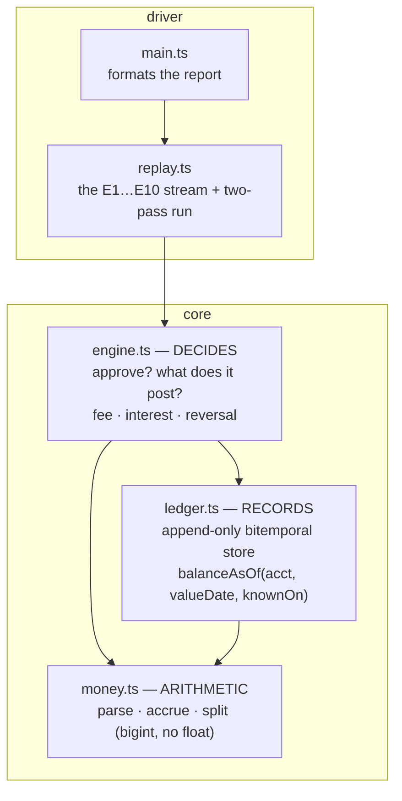
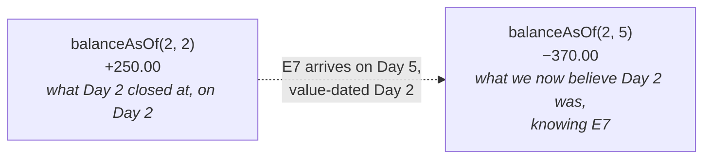
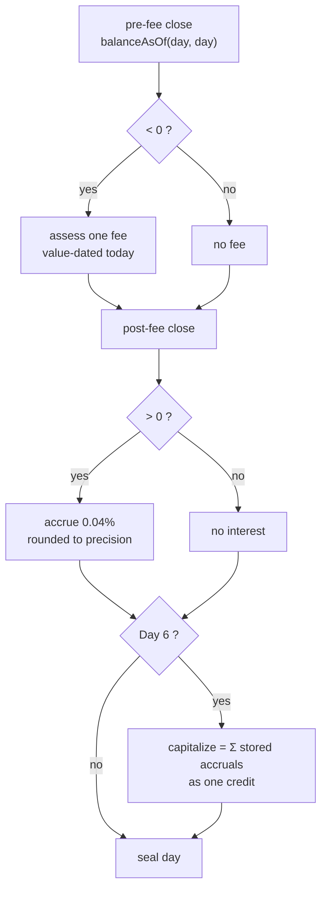
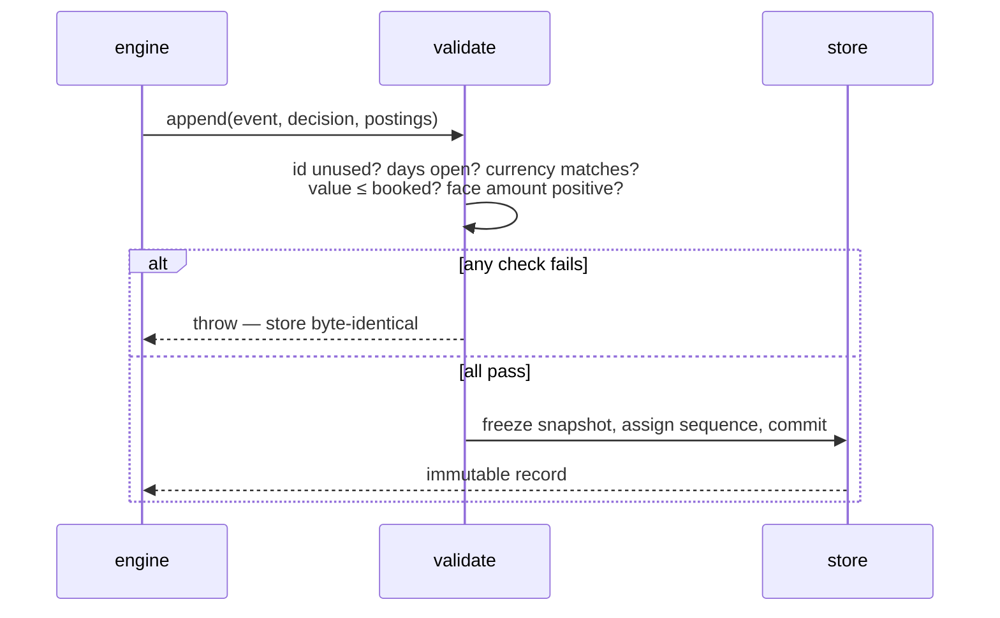

# Architecture

**In one line:** a store that only *records* and *answers*, a rules layer that only *decides*, and an exact-money layer underneath both. No component holds mutable derived state.

## Modules

Each arrow is a one-way dependency. The ledger never imports the engine: it cannot know *why* an event was applied, only *that* it was. That is what lets the same store serve auditing, reporting, and replay without a rule leaking into the record.

| Module | Responsibility | Explicitly not its job |
|---|---|---|
| [money.ts](src/money.ts) | exact amounts, one-step rounding, conserving split | knowing what a balance *means* |
| [ledger.ts](src/ledger.ts) | store events, validate, answer `balanceAsOf` | deciding approvals, fees, interest |
| [engine.ts](src/engine.ts) | every business decision | storing anything; it holds no state |
| [replay.ts](src/replay.ts) | the supplied stream, run end to end | formatting |
| [main.ts](src/main.ts) | render the report | any arithmetic — it only reads |

## The two clocks (bitemporal)

Every event is placed on a grid, not a line. `balanceAsOf(a, v, k)` sums the postings in the lower-left rectangle: value date ≤ `v` **and** booked day ≤ `k`.

Same value date, two knowledge dates, two correct answers. A single-clock ledger would have to pick one and would hide the other — including the place the acceptance criteria conflate them. See [AMBIGUITIES §1](AMBIGUITIES.md).

## The day-close pipeline

Order matters and is fixed. Per account, per day ([`closeDay`, engine.ts:314](src/engine.ts:314)):

- **Trigger reads the *pre-fee* balance** ([engine.ts:317](src/engine.ts:317)) — otherwise the fee counts toward its own condition and cascades.
- **Interest accrues on the *post-fee* balance** ([engine.ts:321](src/engine.ts:321)) — the fee is part of today's close. On a fee day this is unobservable (both bases are negative); it is written down *because* it is invisible. See [AMBIGUITIES §4](AMBIGUITIES.md).
- **Capitalization is the exact sum of the stored daily accruals** ([engine.ts:271](src/engine.ts:271)), so "the accruals sum to the capitalized total" holds by construction — no remainder can exist to discard.
- **Seal is last and in order** ([`sealDay`, ledger.ts:283](src/ledger.ts:283)). A later back-valued arrival restates the past without any published figure being rewritten.

## Append-only, and what it forbids

Everything is validated *before* anything is committed ([`append` → `#validate`, ledger.ts:180](src/ledger.ts:180)), so a rejected append cannot burn a sequence number or an event id.

The store enforces, among others: a sealed day accepts no new events for that booked day; an event and its postings must name the same account; currency identity is code **and** scale (`{AED,2}` ≠ `{AED,3}`); face amounts are positive and direction comes from the event kind. Input is snapshotted and shallow-frozen — dinero amounts are already immutable, so a deep freeze would only break the library. Full list in [AMBIGUITIES §10](AMBIGUITIES.md).

## State, held in exactly one place

There is no cache to invalidate. Holds are **derived** from the record log on demand ([`holdsOn`, engine.ts:75](src/engine.ts:75)) — an approved authorization with no settlement against it — rather than stored in a second register. Past-day accruals are recomputed from a sealed day's balance ([`accrualOn`, engine.ts:254](src/engine.ts:254)), not memoized. If it can be derived from the log, it is not stored.
