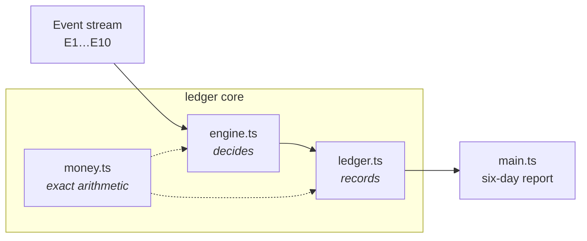

# ledger-app

An in-memory, append-only account ledger core. It ingests a stream of banking events, closes each day, and answers one primitive question exactly: **what was an account's balance, on a given value date, as known on a given day?**

The whole design turns on that "as known on" clause. Every event carries two clocks, and keeping them apart is what makes the fee, interest, and reversal rules come out right — and what makes one property (arrival-order-independent fees) provably impossible, demonstrated in a single deliberate failing test.



## The one idea: two clocks

| Clock | Field | Means | Moves forward only? |
|---|---|---|---|
| **Knowledge time** | `bookedDay` | the day the bank *learned* the fact | yes — the past is fixed |
| **Effect time** | `valueDate` | the day the money is *deemed to move* | can be earlier than booked (E7, E9) |

There is no "the balance" — only [`balanceAsOf(account, valueDate, knownOn)`](src/ledger.ts:260), both cutoffs always named. Fees are decided at **knowledge time**: each day's fee is settled once, at that day's close, from what was known then, and a sealed day is never re-opened.

## Quickstart

```bash
bun install
bun run typecheck          # strict TS, no errors
bun run test               # the green suite — all pass
bun run replay             # prints the six-day report
bun run test:known-failing # the ONE deliberate failure — exits non-zero on purpose
```

`bun run replay` reproduces:

| Account | D1 | D2 | D3 | D4 | D5 | D6 | Capitalized | Final |
|---|--:|--:|--:|--:|--:|--:|--:|--:|
| ACC-001 (AED) | 250.00 | 250.00 | 650.00 | 465.00 | −180.00 | 440.00 | 0.83 | **440.83** |
| ACC-002 (BHD) | 0.000 | 0.000 | 0.000 | 0.000 | 10.000 | 10.000 | 0.008 | **10.008** |

One overdraft fee only (AED 25.00, value-dated **Day 5**). The full derivation is in [NUMBERS.md](NUMBERS.md).

## Where to read next

| Doc | Audience | What it answers |
|---|---|---|
| [ARCHITECTURE.md](ARCHITECTURE.md) | technical | how the pieces fit; the day-close pipeline; append-only invariants |
| [NUMBERS.md](NUMBERS.md) | technical + product | every figure in the table, derived by hand |
| [AMBIGUITIES.md](AMBIGUITIES.md) | technical + product | the 11 under-specified points and how each was resolved |
| [REJECTED.md](REJECTED.md) | product | the four acceptance criteria this build refutes, and why |
| [WORKLOG.md](WORKLOG.md) | — | the build timeline |

## Design commitments

- **No float ever touches a balance.** All arithmetic is dinero.js via its bigint entry point. AED stores 2 decimals, BHD 3; a mismatch of code *or* scale is a hard error, never silently reconciled.
- **Append-only.** Validation completes before anything is committed, so a rejected append leaves the store byte-identical. A rejected event still earns a record — with zero postings.
- **The engine decides; the ledger records.** Holds are derived from the record log, never stored in a second register that could drift.
